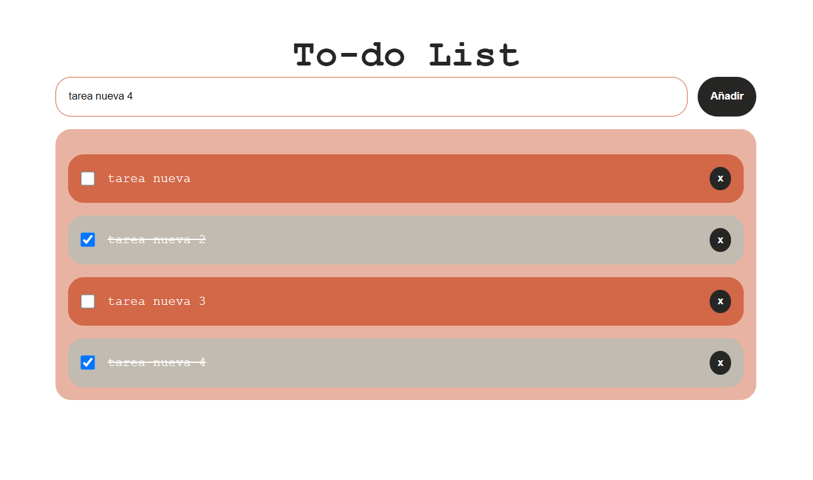

📝 To-do List con almacenamiento en LocalStorage
Esta es una aplicación web sencilla de lista de tareas (To-do List) que permite al usuario:

Añadir nuevas tareas

Marcar tareas como completadas

Eliminar tareas individuales

Persistir los datos usando localStorage, conservando el estado incluso al recargar la página

🧠 Tecnologías utilizadas
HTML, CSS (con estilos personalizados)

JavaScript puro (sin frameworks)

localStorage para persistencia de datos

⚙️ Funcionalidades principales
✅ Añadir tareas: El usuario puede escribir una tarea en el input y pulsar “Añadir” para incorporarla a la lista.

📦 Persistencia con localStorage: Las tareas se guardan en el almacenamiento local del navegador, por lo que no se pierden al recargar la página.

🗑️ Eliminar tareas: Cada tarea tiene un botón de eliminación individual.

✔️ Marcar como completada: Las tareas se pueden marcar como completadas, lo cual aplica un estilo (tachado + cambio de color).

🎨 Interfaz amigable: Diseño visual con colores diferenciados para tareas completadas y pendientes.

💡 Ideal para:
Aprender conceptos básicos de JavaScript y manipulación del DOM

Practicar el uso de localStorage

Iniciar con el desarrollo de pequeñas SPA sin frameworks
